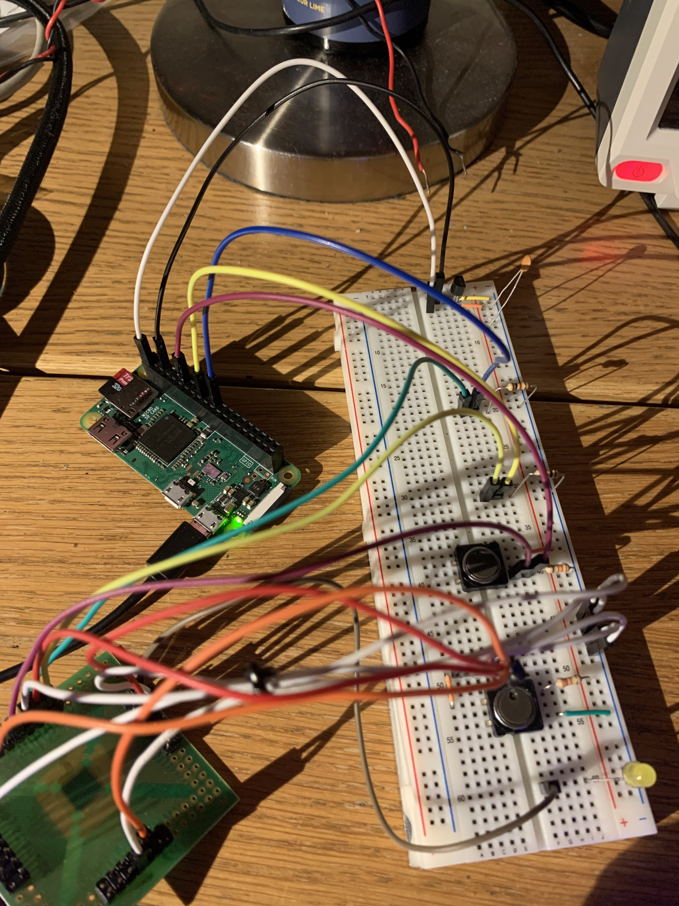
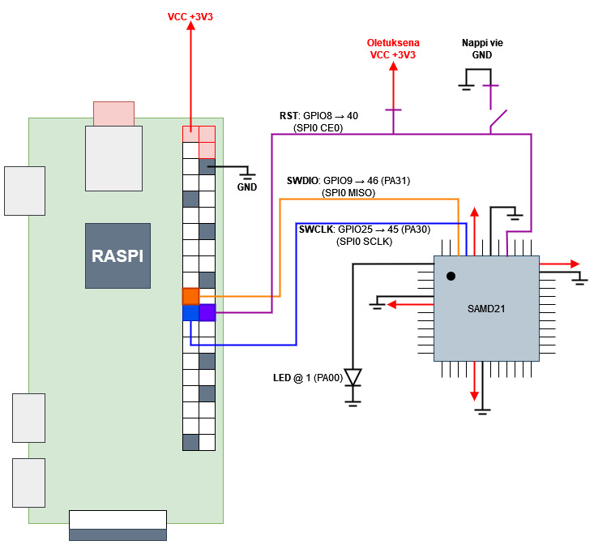
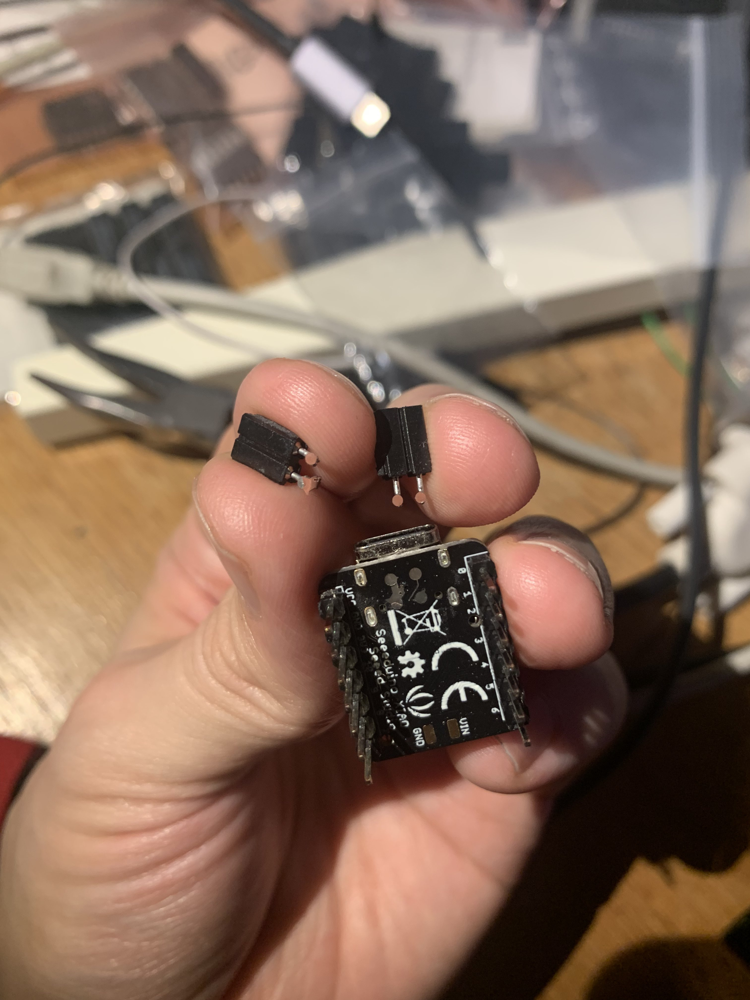
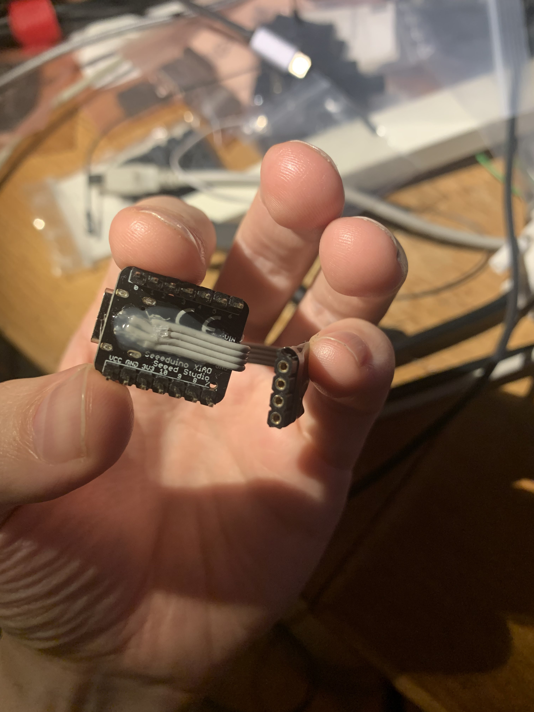

2023-09-18
# SAMD21 Blinky

### 'Paljaan metallin' vilkkudemo.

Treeniä lähinnä openocd:n käyttöön, yleiseen C-ristikääntämiseen, makefileen, linkeriskriptiin ymv.
Mitä nyt ikinä tarvitseekaan siihen että saa C:llä kirjoitetun koodin käännettyä raspin komentorivillä ja puskettua sen GPIO:ta pitkin paljaalle SAMD21-sirulle.

## Taustana:
Minulla on laatikossa iso määrä halpoja [Seeeduino XIAO -kehitysalustoja](https://wiki.seeedstudio.com/Seeeduino-XIAO/), joissa sisällä [SAMD21-prosessori](https://www.microchip.com/en-us/product/atsamd21g18) (ARM cortex-M0+). Ne on ihan näppäriä ja Arduino-yhteensopivia, mutten oikein tykkää Arduino-IDE:stä kun se on niin hidas käynnistymään ja monen tiedoston modulaarisen koodin (`main.c + funktiot.h + funktiot.c` -rakenne) naputtelun pelittämään saaminen vähän semmone häslinki että tuntuu ettei tämä IDE välttämättä ole meittikoodaukseen se paras väline. Lisäksi kortissa on sirun 48:sta tarjolla vain n.14, mikä tuntuu periaatteellisella tasolla vähän pahalta. Sirussa itsessään on vääntöä vaikka mihin, tämänhetkisenä ajatuksena olisi sisällyttää se näppäimistöön lukemaan näppäinten painalliksia (monta GPIO-pinniä) ja sylkemään tulokset tietokoneen suuntaan USB-kaapelia pitkin (sisäänrakennettu USB). Tähän tarvitsen sekä paljaan sirun että kyvyn sen ohjelmoimiseen.

Aikani asioita googlailin ja lueskelin, opettelin välissä AVR assemblyn perusteet ymmärtääkseni rekisterilähestymisen kunnolla, ja pitkän yritys-erhe-ketjun kautta sain homman pelittämään. Tässä repossa käyn ketjun tiivistetyssä muodossa läpi, osittain muistiinpanoina itselleni, osittain dokumentaationa jos joku joskus yrittää väsätä mitään vastaavaa.

Lyhykäisyydessään homman lopputulos on se, että painan napilla SAMD21-sirun RESET-pinnin +3,3 V jännitteeseen ja ajan `bash makebuild.sh`, jolloin Raspi kääntää koodin ja lähettää sen sirulle. Kun päästän RESET-napista irti ja painan sen takaisin alas, siru suorittaa koodin. Tässä tapauksessa suoritus on että pinni 1 (PA00) lähtee vilkkumaan harventuvaan tahtiin. Kun tahti on liian harva, aloitetaan uudestaan tiheästä vilkkumistahdista.

## Tiedostojen rakenne
- `makebuild.sh`: käännä ja linkkaa C-koodi, lähetä Raspin GPIO:lla sirun suuntaan
- `build.sh`: eka iteraatio, jossa en vielä käyttänyt `make` ja joka vain käänsi koodin
- `Makefile`: `make` vaatima ohjeistus sille, mitä oikeastaan pitää tehdä
- `linker.ld`: linkerin tarvitsema skripti, joka asettaa käännetyn koodin oikeille paikoille
- `putsaa.sh`: skripti, joka poistaa käännöksen tulokset ja voi aloittaa puhtaalta pöydältä
- `src`-kansiossa C lähdekoodi
- `openocd`-kansiossa openOCD skriptit
- `img`-kansiossa tämän readme-tiedoston tarvitsemat kuvat
- `build`-kansiossa kääntäjän ja linkkaajan tiedostoulostulot

## Rautalankareitti, Microchip Studio + Rasberry Pi Zero + openOCD

### Microchip Studio
AVR-assemblyä naputellessa tuli tutustuttua Microchipin omaan kehitysympäristöön, [Microchip Studioon](https://www.microchip.com/en-us/tools-resources/develop/microchip-studio). Sekin on aika ajeltava (ja vain winukalle), mutta etenkin AVR-kehityksessä tosi hyvä kapine kun koodia voi simuloida ja katsella mitä ihmettä rekistereissä tapahtuu (ts. _on tapahtumatta_) missäkin vaiheessa. SAMD21:lle C-koodin naputtelun kannalta tämä oli helppo paikka aloittaa, koska tiedän softan kääntönamiska tuottaa automaagisesti `.elf`- ja `.bin`-tiedostot, jotka on varmasti kaikin puolin oikealle arkkitehtuurille käännetty ja siten pyörivät varmasti oikein, kunhan ne on saanut roudattua raudalle asti. Jos olisi myös näiden (överikallis) [virallinen ohjelmointilaite](https://www.digikey.fi/fi/products/detail/microchip-technology/ATATMEL-ICE/4753379), sen saisi rakennuksen yhteydessä sylkemään koodin raudalle asti.

### SWD-protokolla
Raudalle roudaamiseen väylänä on nk.SWD-protokolla, joka on oikeastaan vain JTAG mutta eri nimellä ja pienillä poropietaroinneilla. Raudan puolella kommunikaatioväylä on sidottu [pinneihin](https://ww1.microchip.com/downloads/aemDocuments/documents/MCU32/ProductDocuments/DataSheets/SAM-D21-DA1-Family-Data-Sheet-DS40001882H.pdf#page=21) `PA30` (SWCLK, kelloväylä) ja `PA31` (SWDIO, dataväylä). Lisäksi tarvitaan tietenkin maa, mutta ei välttämättä esimerkiksi virtapiuhaa. Resettisignaali on vähän kysymysmerkki, tuntuu toimivan ilmankin. Huomaa että rajapintapinnit on kiinnitetty pinninimiin eikä pinninumeroihin: esim. SAMD2XG-sarjassa (se mitä tässä pyörittelen) `PA30` on fyysisessä pinnissä 45 ja `PA31` pinnissä 46, mutta esim. E-versiossa pinnejä on 48 sijaan 32 ja PA30 sijaitsee näistä pinnissä 31. Eka asia minkä kanssa kämmin oli että yhdistin piuhat pinneihin numero 30 ja 31. XIAO-kehityskortissa nämä sijaitsee kortin pohjassa, vähän vaikeasti sörkittävinä padeina. Ne myös lähtee suht helposti irti, yhteen kolvasin hyppylanka-adapterit kiinni ja ne lähti padeineen irti, ja se oli sen kortin loppu se (tästä lisää myöhemmin).

### openOCD ja raspi
[openOCD on monipuolinen ohjelmointisofta](https://openocd.org/), jolla saa käytännössä tungettua ajokoodia koneelta kuin koneelta raudalle kuin raudalle. Joku sankari on tämän naputellut opinnäytetyönä, ja yhteisö jatkanut sitä siitä. Se tukee montaa suoritinsirua ja montaa eri ohjelmointilaitetta, sekä USB-väylään tökättäviä dongleja (esim. ST-LINK ja BusPirate) että Raspberry Pin GPIO-väylää.
openOCD ajeluun Raspberry Pillä löytyi [tosi hyvä tutoriaali adafruitilta](https://learn.adafruit.com/programming-microcontrollers-using-openocd-on-raspberry-pi), joskin siinä käytettiin Zeron sijaan ihan oikeaa raspia ja koodia piti vähän muokkailla. Sen lisäksi käytin tukena [tätä tutoriaalia](https://forum.seeedstudio.com/t/how-to-unbrick-a-dead-xiao-using-st-link-and-openocd/255562), jossa tyyppi tuuppasi XIAO:lle Arduinon bootloaderin ST-LINK:illä.

Piuhoitettu versio näyttää suunnilleen tältä

</img>

Suurin osa piuhojen sotkuisuusluukista tulee siitä, että SAMD21 virroittaa itsensä niin, että joka sivulta lähtee virtapiuha (pinnit 6, 17, 36, 44) ja maapiuha (pinnit 5, 18, 35, 42), [mitkä olisi kaikki suotavaa kytkeä](https://ww1.microchip.com/downloads/aemDocuments/documents/MCU32/ProductDocuments/DataSheets/SAM-D21-DA1-Family-Data-Sheet-DS40001882H.pdf#page=37). Kuvassa ne on nuo punaiset ja valkoiset niput. Nämä on kytketty jännitteentasaajan kautta Raspin 3V3-paikkaan ja maahan (Raspi-pinnit 1 ja 6). Näiden lisäksi pinni 45 (`PA30`, SWCLK) menee raspin pinniin 22 (`GPIO25`), pinni 46 (`PA31`, SWDIO) menee raspin pinniin 18 (`GPIO24`) ja pinni 40 (`~RST`) on effektiivisesti sidottu käyttöjännitteeseen.
piiroksena homma on huomattavasti selkeämpi:

</img>

Kuten edellä linkatuissa mainitaankin, openOCD etsii oletuksena skriptitiedostoa `openocd.cfg`, aloittaen kutsukansiosta. Flagilla `-f` saa speksattua jonkun muun skriptin ajettavaksi. Eka sanity check piuhoituksissa on katsoa, vastaako ohjelmoitava siru mitään listauskomentosarjaan:
```cfg
# target.cfg
source [find atsamd21.cfg]
set transport swd

set CHIPNAME at91samd21g18
source [find target/at91samdXX.cfg]

init
targets
reset init
shutdown
```
Itsellä ainakin kävi niin, etten ihan joka jalkaa ollut saanut kunnolla kolvattua, ja joku kriittisistä ei ollutkaan kontaktissa pinneihin. Tällöin edellä kuvattu skripti antaa virheeksi jotain tämän suuntaista.
```
Open On-Chip Debugger 0.12.0+dev-00275-ga5108240f (2023-07-31-18:22)
Licensed under GNU GPL v2
For bug reports, read
        http://openocd.org/doc/doxygen/bugs.html
Info : BCM2835 GPIO JTAG/SWD bitbang driver
Info : clock speed 399 kHz
Error: Error connecting DP: cannot read IDR
```
jolloin on syytä tarkistaa piuhoitukset (ja esim. että onko `RST` varmasti ajettu maahan). Onnistuneessa tapauksessa vastaus on muotoa
```
Open On-Chip Debugger 0.12.0+dev-00275-ga5108240f (2023-07-31-18:22)
Licensed under GNU GPL v2
For bug reports, read
        http://openocd.org/doc/doxygen/bugs.html
Info : BCM2835 GPIO JTAG/SWD bitbang driver
Info : clock speed 399 kHz
Info : SWD DPIDR 0x0bc11477
Info : [at91samd21g18.cpu] Cortex-M0+ r0p1 processor detected
Info : [at91samd21g18.cpu] target has 4 breakpoints, 2 watchpoints
Info : starting gdb server for at91samd21g18.cpu on 3333
Info : Listening on port 3333 for gdb connections
[at91samd21g18.cpu] halted due to debug-request, current mode: Thread
xPSR: 0x21000000 pc: 0x000000cc msp: 0x20001fb8
shutdown command invoked
```
eli sirulta saatiin perustiedot (malli Cortex-M0+, IDR) ulos.
Sirulle ohjelmointia varten sille pitää tarjota validi binääri ja lisäksi speksata muistiosoitetiedot. Image program -menetelmässä menee jostain syystä eri reittiä, en tiedä mikä homma. Ohessa esimerkkikutsu `ulostulo.elf` laitteelle lähettämiseen:
```
# openocd_oma.cfg
# 2023-09-08
#source [find omat/atsamd21.cfg]
source atsamd21.cfg
set transport swd

set CHIPNAME at91samd21g18
source [find target/at91samdXX.cfg]

init
targets
at91samd chip-erase
reset init
program ulostulo.elf
reset
exit 0x08000000
shutdown
```
jolloin ulostulo on suunnilleen
```
Open On-Chip Debugger 0.12.0+dev-00275-ga5108240f (2023-07-31-18:22)
Licensed under GNU GPL v2
For bug reports, read
        http://openocd.org/doc/doxygen/bugs.html
Info : BCM2835 GPIO JTAG/SWD bitbang driver
Info : clock speed 399 kHz
Info : SWD DPIDR 0x0bc11477
Info : [at91samd21g18.cpu] Cortex-M0+ r0p1 processor detected
Info : [at91samd21g18.cpu] target has 4 breakpoints, 2 watchpoints
Info : starting gdb server for at91samd21g18.cpu on 3333
Info : Listening on port 3333 for gdb connections
Error: [at91samd21g18.cpu] clearing lockup after double fault
[at91samd21g18.cpu] halted due to debug-request, current mode: Handler HardFault
xPSR: 0xf1000003 pc: 0xfffffffe msp: 0xffffffd8
[at91samd21g18.cpu] halted due to debug-request, current mode: Handler HardFault
xPSR: 0xf1000003 pc: 0xfffffffe msp: 0xffffffd8
** Programming Started **
Info : SAMD MCU: SAMD21G18A (256KB Flash, 32KB RAM)
** Programming Finished **
Error: [at91samd21g18.cpu] clearing lockup after double fault
[at91samd21g18.cpu] halted due to debug-request, current mode: Handler HardFault
xPSR: 0xf1000003 pc: 0xfffffffe msp: 0xffffffd8
```
Rivit joilla seisoo hauskan kuuloisia avainsanoja `Error` ja `Handler HardFault` on tosi uhkaavan kuuloisia, mutta kuuluvat asiaan. Pääasia on että `** Programming Started **` ja `** Programming Finished **` välissä kaikki on siististi. Jos jokin kusee, saadaan huomattavasti enemmän erroreita ja mukana on `** Programming Failed **` sisältävä rivi.

## Kääntäminen raspin päädyssä
Edellä kuvatulla tavalla homman saa toki pelittämään, mutta elffi/binääritiedoston siirtely Winukan Microchip-kansion ja raspin välillä on vähän mendoks. Optimaalista olisi, jos koko homman saisi tehtyä allusta loppuun raspin päädyssä. Eli aika opetella ristikääntämään.

Aiemminkin linkattu bare metal blinky toimi tosi hyvänä lähteenä tälle, tyypin reposta löytyi kääntökomennot ja linkkeriskriptit ja kaikki. Siruna oli SAMD21 sijaan SAMD20, mutta eipä näiden välillä moneen muuttujaan tarvitse koskea jotta saa ledin vilkkumaan. Toinen hyvä lähde hommaan oli [tämä missä tyyppi tekee vastaavaa NRF52-sirulle (Cortex-M4)](https://iosoft.blog/2019/09/28/arm-gcc-lean-nordic-nrf52/), eri siru mutta sama `arm-none-eabi-XXX`-paketti (`gcc`, `as`, `ld` jne jne) toimii kaikille Cortex-sarjan mikroprosessoreille.
Käännösflagien kanssa pitää olla tarkkana, ei voi oikein oikoa mutkia suoriksi.
Huomionarvoista on myös se, että yleisesti ottaen MCU-ohjelmoinnissa linkkeriskripti on tosiaan aikas välttämätön, koska suoritinkomennot ja datamuisti on periaatteessa yhtä ja samaa jatkumoa, ja esimerkiksi interruptit toimii niin että tapahtuman myötä suoritin hyppää kovakoodatulle riville ja tekee mitä siinä ohjeistetaan. Käskyjen ja datojen on siis perempi olla järkevillä paikoilla...

Makefile esittämä flow on suunnilleen seuraava:
  - luo tarvittavat kansiot
  - käännä interruptien vektoritaulu linkkeriskriptiin nojaten
  - käännä main
  - lado tulokset niin, että flashin alussa on interrupt-taulu, sen jälkeen main, ja dataosuuksissa settien datat (jos olisi)
`makebuild.sh` on bash-skripti, joka kutsuu ensin `make` (aja Makefile proseduuri) ja sen jälkeen laita openOCD lähettämään tulos sirun suuntaan. Ta-da!

`build.sh` on ensimmäinen iteraatio jonka sain toimimaan, otettu aika suoraan lähteestä.
Siitä siirryin `make` käyttöön ja ihmettelin aikani miten ihmeessä linkeriä pitäisi käyttää. Mikrokontrollereissa kun täytyy olla ne interruptimääritelmät koodin alussa, niin sillä on kovastikin väliä missä järjestyksessä koodiosuudet on.

`openocd`-kansion alla on setupit mitä käytin openOCD:lle. Pääskripti `openocd_oma.cfg`, apuna `atsamd21.cfg` jossa määritelty raspin kellotaajuudet ja ohjelmointipinnit ymv. Perusflow olisi sisällyttää `atsamd21.cfg` ohjelman scriptikansioon (`/usr/local/share/openocd/scripts/alikansio`) josta sen voi helposti sisällyttää myöhempiin setteihin.


## Ne XIAO:n pohjan padit
Seeeduino XIAO:n pohjassa on tarjolla väylä noihin ohjelmointiin tarvittaviin SWD-pinneihin, ja se on siinä mielessä kivempi ohjelmoitava että sirun virransyöttö ja maadoitus hoidetaan kortin puolella (maa+virta vs. neljä maata ja neljä virtaa). Jos pärjää rajoitetulla IO-pinnimäärällä, se on kaikin puolin parempi testikapine. Oikeastaan ainoa ongelma on se, että ohjelmointiväylä on hankalasti: sirun pohjassa ja pelkkinä metallipadeina eikä esim. pinneinä tai minään mihin saisi järkevästi juotettua pinnit. Ekana yrityksenäni juotin siihen naarasrimaa 2+2, siten että taivutin pinnien päädyt sopivasti. Tällöin kortti mahtuu yhä leipälaudalle, mutta siinä on lisäksi vaakatasoon osoittavat naaraspinnit mihin voi tökätä hyppylangat. Paitsi että...

</img>

...paitsi että se pieni vääntömomentti mitä tuli, riitti siihen että palikat repi padit irti PCB:stä. Raakametallikoodin laitto sirulle meinaa, että Arduino-bootloader pyyhitään tieltä pois, ks. [How to unbrick a dead XIAO using ST-LINK and OpenOCD](https://forum.seeedstudio.com/t/how-to-unbrick-a-dead-xiao-using-st-link-and-openocd/255562). Toisin sanottuna siruun ei saa enää koodia SWD-rajapintaa pitkin koska padit on mennyttä, eikä myöskään Arduino-IDE kautta koska bootloaderi on heivattu sirulta hevon helvettiin. Kyseinen bootloader toimii käytännössä niin, että [johto yhdistyy suoraan sirun USB-pinneihin](https://files.seeedstudio.com/wiki/Seeeduino-XIAO/res/Seeeduino-XIAO-v1.0-SCH-191112.pdf), siru näyttäytyy muistitikkuna ja uudelleenohjelmoi itse itsensä annetulla datalla. Vrt. Arduino UNO ymv joissa ohjelmoitavan sirun lisäksi kortilta löytyy toinen Atmelin siru, jonka tehtävä on hoitaa kommunikaatio PC:n kanssa ja sen pääsirun ohjelmointi. Siinä mielessä aika päheää toteuttaa koko homma vain yhdellä sirulla.

Tästä oppineena tein kakkositeraation, jossa kolvasin padeihin muotoon leikattua lattakaapelia, ja laitoin kaveriksi *reilusti* erikeepperiä. Pysyy paikallaan ja ainoan väännön pitäisi olla piuhan taivuttelu, eli ei ainakaan padeja pitäisi rasittaa:

</img>
